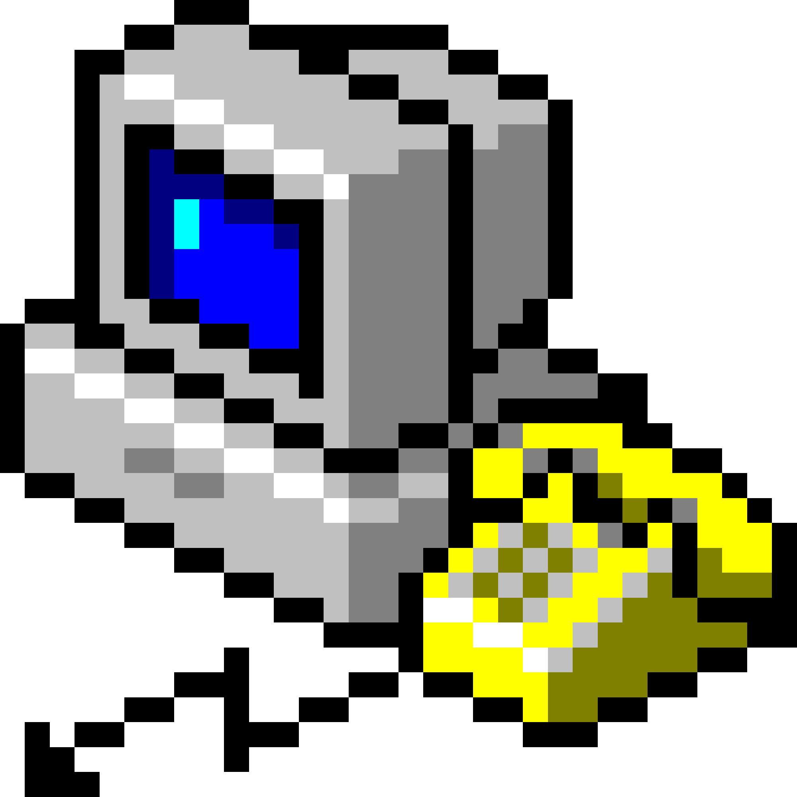
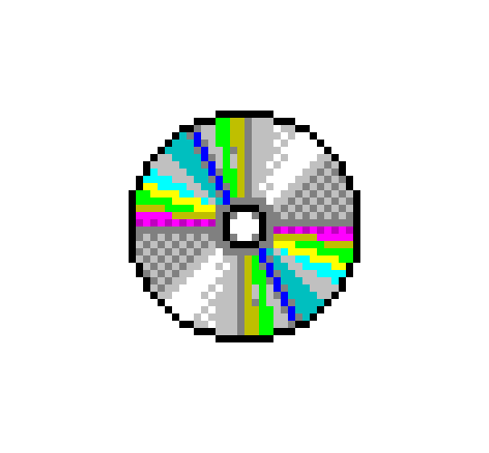

    

I am currently a Third Year Software Engineering student @ McMaster University.

Currently, I'm in the process of creating a 1-1 word translator between English and Japanese. This webscrapper has been my passion project for the past 2 years, with the idea originally stemming from needing a tool to assist with my Japanese studies (which I have been learning for the past 5 years)

## My Skills

    
    
    
    
    
    
    
    
    
    
    
    
    
    
    
    
    
    
    
    
        

##Interests

    <a href="https://letterboxd.com/peakv/">
        
    <a>
    <a href="https://rateyourmusic.com/~dmtetra">
        
    <a>

